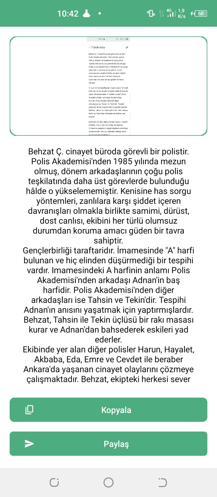

# OCR-Android

An OCR application for android using Google ML kit



## How to use Google ML Kit for Android

Gradle
```kotlin
implementation 'com.google.android.gms:play-services-mlkit-text-recognition:18.0.2'
implementation 'com.google.android.gms:play-services-vision:20.1.3'
```

Manifest
```kotlin
<meta-data
   android:name="com.google.mlkit.vision.DEPENDENCIES"
    android:value="ocr" />
```


## Demo


## Used libraries
- [Google ML Kit](https://developers.google.com/ml-kit)
